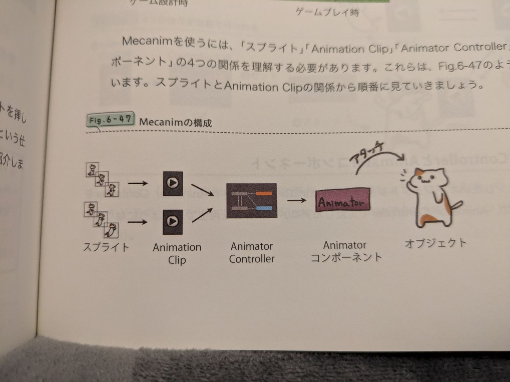

# 2D開発

## タイルマップ

タイルマップを使用してクウォータービューを作ったりスプライトエディターを使用してまとめた画像を切りだすスプライトを作ったりもできる

- ヒエラルキー上で右クリックし`2D Object > Tilemap`を選択すると `Grid > Tilemap` と2つのオブジェクトが作られる
- タイルマップで使用するタイルを作る(タイルマップでは直接スプライトを使わずにタイルを使う)プロジェクトウィンドウで任意のフォルダで右クリックして `Create > Tile` でタイルを作る
- 作成したタイルを選択しインスペクタを表示するとタイルに割り当てる画像(スプライト)を指定するスロットがあるので、スプライトとしてプロジェクトに保存しているものを指定する
- 作成したタイルをタイルマップに指定するには Tile Palette を使用する。Window > 2D > Tile Palette でTile Palette が開く。このTile Palette で絵具のパレットのようにタイルを準備しておき、シーンビューにて配置をしていける。
- Create New Palette で新しいパレットを作る。
- 作成したパレット上に先に作ったタイルをドラッグする
- グリッドへの収まりが悪い場合は、スプライトを選択するとPixels per Unit のプロパティがあるので、スプライトの大きさに合わせ調整していい感じにする
- タイルは多ければいいが、分割された画像を一つ一つスプライトとしてインポートするよりも、分割前の画像をインポートして、スプライトエディターで分割する方がパフォーマンス面でよい
  - スプライトのモードをSingleからMultipleにする
  - Pixel per Unit を画像に合わせる
  - インスペクタからスプライトエディタを開く
  - slice を選択すると自動でスライスするか手動かなどの設定があるので選択して確定する
  - 作成したスプライトをパレットに乗せて先のようにシーンビューで使用する


## タイルマップの当たり判定を最適化する方法

- タイルマップにコライダーを追加するときは、該当のタイルマップをヒエラルキーで選択して`Tilemap Collider 2D`コンポーネントを追加する。
- すべてのタイルにコライダーが付くので、プロジェクトウィンドウで衝突検出のいらないタイルを、インスペクターの`Collider Type`を`none`とする。
- **隣り合うタイル同士にコライダーがついていると、無駄に衝突検出したりして重たくなる**ので、タイルマップに`Composite Collider 2D`を追加する。
- Composite Collider 2DのUsed By Compositeにチェックを入れると隣り合うコライダー同士が一つの塊とみなされる
- また、Rigid Body 2DのBodyTypeをstaticにしておくと物理演算の処理をさらに減らせる

## 2Dでの描画順序

**描画順について2Dの場合z軸を使ってレイヤ分けするのではなく、y軸の上下関係で描画順を決定することがある**

- y軸座標に基づいて描画順を決定する場合は`Edit > Project Settings > Graphics > Camera Settings > Transparency Sort Mode` をDefaultからCustom Axisへ変更
- Transparency Sort Axisにてy軸へ１を入力し、y軸を使用するよう設定
- 後はスプライトにおいて、y軸にて上か下か判定するポイントがあるので変更する
  - 描画順を制御したいゲームオブジェクトのSprite Rendererコンポーネントで、Sprite Sort Pointを**Pivot**にする(Pivotに設定したポイントを基準にする)
  - 該当のスプライトを選択し、
    - 単一のスプライトであればインスペクターからPivotを変更
    - 複数のスプライトであればSprite EditorからPivotを変更
    - 大体の場合はキャラ、フィールドのもの共にBottomとなるが、常にフィールドのもので常に後ろに表示したいものはTop？

## スプライト

- ゲームオブジェクト作成する際に2Dオブジェクト→spriteを選択する(sprite rendererコンポーネントのついているオブジェクトができる)  
- sprite rendererコンポ―ネントのspriteプロパティにspriteに表示したい画像を指定する
- スプライト用に用意された画像をそのままシーンビューにドラッグしても上記のsprite rendererコンポーネントにspriteプロパティに画像指定までが行われる
- オブジェクトを拡大(ScaleツールではなくRectツールで)する場合に、レンダリングするスプライトが伸びて表示されてしまうことがあるが、ある程度拡大したら複数のスプライトをリピート表示してカバーすることができる。
  - 該当のゲームオブジェクトのスケールを1,1,1とする
  - Sprite RendererコンポーネントでDraw ModeをTiledに、Tile ModeをAdaptiveにする
  - オブジェクトに割り当てているスプライトのMesh TypeをFull Rectにする

## アニメーション制御

アニメーションを作成する際のイメージは下図



### アニメーションの作成

- スプライト(コマ)を準備する
- スプライトを繋げてアニメーションクリップを作る
    - ヒエラルキーでオブジェクトを指定して`Window > Animation`でアニメーションを作成するとクリップ作成・コントローラー作成・Animatorコンポーネントアタッチまでが行われる
- アニメーションコントローラーでクリップ間の遷移を指定できる。オブジェクトの始まりはこのクリップ、このクリップ再生が終わったら次はこのクリップ…等
- その他基本は教科書のやつ参照
- クリップの遷移にトリガーを指定することができる。トリガーを作成したら、遷移矢印にそのトリガーを配置し、スクリプトを次のように実行

### アニメーションの条件付き遷移（ステート間）

- Animatorウィンドウで各アニメーション間に矢印を引いて遷移を指定する(矢印の繋がっていないアニメーション間では遷移できない)
- 矢印をクリックするとインスペクターが表示され、その遷移の条件を`Conditions`に指定することができる
  - `Conditions`が指定されていなければ、その矢印の前にあるアニメーションが終了したら次のアニメーションへ遷移する
  - `Conditions`にパラメータを指定する場合は
    - `ウィンドウ > アニメーション > アニメーターで`**アニメーターウィンドウ**を開き、`Float`、`Bool`、`Trigger`等の型の**パラメータ**を作成しておく。
    - `Conditions`に作成したパラメータの値がどのようになればアニメーションを遷移するかを指定する。`Bool`型であれば`true`または`false`の時、`Float`型であれば値がxx以上になった時など。トリガー型の場合は一度遷移(`true`)したらその後元に戻る(`false`)
    - スクリプト側から任意のタイミングで下記のパラメータをセットする

```
// Jump_trig変数をtrueにする。アニメーションの遷移後、すぐにfalseとなる
animator.SetTrigger("Jump_trig");

// 遷移条件に真偽値を使用し、Death_b変数をtrueにする
animator.SetBool("Death_b", true);

// 遷移条件に整数を使用(変数の値が〇〇だったら、のような感じ)し、Death_int変数を1にする
animator.SetInteger("DeathType_int", 1);
```


### アニメーションブレンドツリー（2D方向別切り替え）

アニメーターコントローラーで、ノード間に矢印を引いてアニメーションの遷移を指定できるが、パラメータに応じて複数のアニメーションをブレンドする、ブレンドツリーというやり方もある。これを使用すると、方向や速度に応じて滑らかにアニメーションを切り替えられる。

- アニメーターコントローラ上で `Create State > From New Blend Tree` で新しいブレンドツリーを作る(Entryから矢印を引く)
- 作成したブレンドツリーのパラメータのタイプ(Blend Type)を 2D SImple Directional 等に指定
- タイプに応じたParametersが出るので型、名前(Move X,Move Y等)を編集する
- Motionタブで+をクリックしてブレンドツリーで指定したいアクションの分だけ項目を追加し、各々アニメーションクリップを指定し、先のパラメータの閾値(Pos X,Pos Y等)を指定
  - 例：PosX,PosY座標を、アニメーション1は(-0.5, 0)、2は(0.5, 0)、3は(0, 0.5)、4は(0, -0.5)
- これでパラメータの値(Move X,Move Y等)を変化させ、閾値(Pos X,Pos Y等)比較を行い、一番近いアニメーションクリップが再生されるように設定された
- あとは任意の箇所で、`animator.SetFloat("Move Y", direction);` 等で先のパラメータを変化させてアニメーションを指定する  

```
animator.SetFloat("Move X", 0);
animator.SetFloat("Move Y", 1);
```

### 例) Animator + トリガーでジャンプアニメーションを再生

```
private Animator playerAnim;
void Start() {
  playerAnim = GetComponent<Animator>();  // Animatorコンポーネントを取得
}
void Update() {
  if (Input.GetKeyDown(KeyCode.Space) && isOnGround) {
    playerAnim.SetTrigger("Jump_trig");  // Animatorコンポーネントでトリガーするアニメーションを指定
  }
}
```

- `SetTrigger("Trigger名")` で、指定したトリガー条件に一致するアニメーションに遷移。

### スプライトアニメーション（複数画像での再生）

1. スプライトシート画像を `Sprite Mode: Multiple` に変更  
2. `Sprite Editor` で分割（`Slice`）  
3. 分割したスプライトを複数選択してヒエラルキーにドラッグで自動アニメーション作成  

### アニメーション完了後に次の動作をしたい場合

```
public void OnAnimationComplete() {
    // アニメーションクリップの最後にイベントを仕込むことで呼ばれる
}
```

- アニメーションイベントを使って、クリップの終了タイミングで任意の関数を呼び出せる