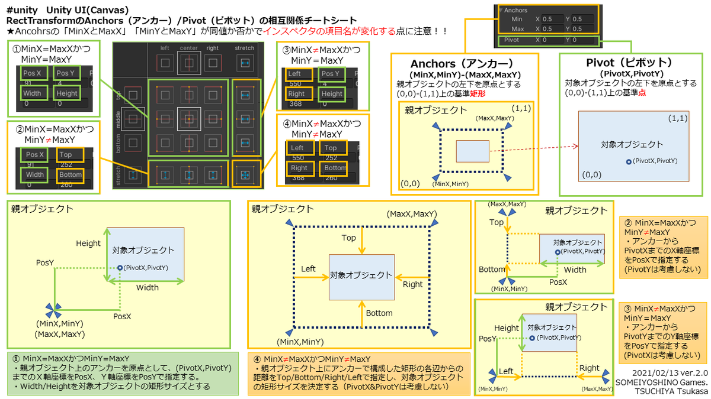

# Unity逆引きリファレンス（UI + エフェクト）

## BGM・SE（効果音）の再生

`Audio Source`はクリップを再生できるコンポーネントだが、`Audio Listener`は音楽を聴くためのコンポーネントで、デフォルトではカメラにアタッチされている。空間音響を使うときに便利※3Dモードで有効  

### ■ BGMの設定

- 対象オブジェクトに `AudioSource` コンポーネントを追加
- `AudioClip` に音楽ファイルをドラッグして設定
- `Play On Awake` にチェックを入れると自動再生
- `Loop` にチェックでループ再生

### ■ SE（効果音）をスクリプトから再生

該当のオブジェクトにAudioSource追加してから下記スクリプトを実行

```
private AudioSource playerAudio;
public AudioClip jumpSound;  // SEはAudioSourceのプロパティではなくスクリプトのpublic宣言した変数にクリップをドラッグする

void Start() {
  playerAudio = GetComponent<AudioSource>();
}

// 任意の場所で(OnColisionEnterとか)
playerAudio.PlayOneShot(jumpsound, 1.0f);
```

アイテムを取った時など、オブジェクトの`Destroy`処理と同時にクリップ再生をしても、オブジェクトそのものが破棄されクリップ再生されない。次の二つの対応方法がある。

1. `Destroy`しないオブジェクト側でクリップを再生する。

```
// 操作するキャラや、ゲームコントローラー等でpublicメソッドを準備
public void PlaySound(AudioClip clip)
{
  audioSource.PlayOneShot(clip);
}
```

```
// Destroyするアイテム側での処理
public AudioClip collectedClip;  // クリップは自前で準備

void OnTriggerEnter2D(Collider2D other)
{
  // 衝突した相手を取得
  RubyController controller = other.GetComponent<RubyController>();

  if (controller != null)
  {
    if (controller.health < controller.maxHealth)
    {
      controller.ChangeHealth(1);
      Destroy(gameObject);
      controller.PlaySound(collectedClip);  // 相手のクリップ再生
    }
  }
}
```

2. `audioSource.PlayClipAtPoint( clip, transform.position);`にすると`Destroy`するオブジェクトからでも一時的に指定したポジションに新規オブジェクトを作って、効果音を鳴らしたら自動的に破棄してくれる。

```
public class MissileController : MonoBehaviour 
{
    // 爆発効果音
    public AudioClip explosionSE;
        
    void OnCollisionEnter2D(Collision2D other)
    {
        if( other.gameObject.tag == "Enemy" )
        {
             // オーディオを再生
             AudioSource.PlayClipAtPoint( explosionSE, transform.position);
             // ミサイルオブジェクトを破棄
             Destroy(gameObject);
        }
    }
}
```

### Audio Listenerの使い方

Audio Listenerをキャラに、Audio Sourceを敵につけて3Dとして、近づいてきたらだんだん音が再生とかもできる

- Audio SourceのSpatial Blendを3Dにする
- シーンビューで表示される円の中にAudioListenerがいると聞こえる
- Min Distance と Max Distanceを調整すると先の円が調整される
- 2Dの場合はカメラの子オブジェクトを作成して、AudioLitener をアタッチ(カメラ本体のListenerは削除)し、z座標を敵のオブジェクトと同じレベルにする

## 🔥 パーティクルエフェクトを再生する

炎、水などの細かいエフェクトは、画像等で表現するのは困難なので、パーティクルを使用する

設定結構多くて省略・・・2D開発入門でいっぱいあった

- 予めパーティクル(.prefab)をアセットストア等で用意し、設定調整。Play on Awakeのチェックは外す
- パーティクルを付けたいオブジェクトにドラッグして、子オブジェクトにする
- パーティクルを付けたオブジェクトのスクリプトで次のようにする

```
public ParticleSystem explosionParticle;  // public宣言としてインスペクタから先に用意したパーティクルを割り当てる

// 任意の場所で
explosionParticle.Play();
explosionParticle.Stop();
```

## 特定のキーの押下検出

```
void update(){
  if (Input.GetKey(KeyCode.Space)){  
    // スペースキー押下げ中の処理
  }
  if (Input.GetKeyDown(KeyCode.Space)){  
    // スペースキー押下げした瞬間の処理
  }
  if (Input.GetKeyUp(KeyCode.Space)){  
    // スペースキー離した瞬間の処理
  }
  if (Input.GetMouseButton(0)){  
    // 左クリック中の処理
  }
  if (Input.GetMouseButtonDown(0)){  
    // 左クリックされた瞬間の処理
  }
  if (Input.GetMouseButtonUp(0)){  
    // 左クリックを離した瞬間の処理
  }
  
}
```

- `Input.GetKey()`、`Input.GetMouse()`で特定のキー、マウスクリックの押下(押されている間ずっと検出)をboolで検出することができる。
- `Input.GetKeyDown()`、`Input.GetMouseButton()`で指定したキー、マウスクリックの押下(押された瞬間だけ)をboolで検出することができる。
- `Input.GetKeyUp()`、`Input.GetMouseButtonUp()`で指定したキー、マウスクリックの離された瞬間をboolで検出することができる。
- 入力はフレーム単位での状態を取得するので、確実に拾えるようにフレームごとに実行される`Update()`の中で使うのが良い。
- 物理演算は`FixedUpdate()`の中で使うのが望ましいが、こっちは定周期で実行するので、`Input`を拾えないことがあるかも。

## ジョイスティック等のアナログ入力(`Input.GetAxis()`)

- `Input.GetButton`、`Input.GetKey`等は押したかどうかを真理値で返すがこれは`float`値を返す
  - 引数に`"Horizontal"`だと → 左: `-1` / 右: `+1`
  - 引数に`"Vertical"`だと → 下: `-1` / 上: `+1`
- `Edit > Project Settings > Input`の項目を確認すると、ゲームパッドのボタンやマウス等のあらゆる入力の軸の設定が表示される Horizontal、Vertical項目へ各動作設定をしておくと、`Input.GetAxis(”Horizontal”)`にて設定した動作で値を取り出せる
- 他にもキー入力をやめてから0に戻るまでの速さ、入力を始めてから最大値に到達するまでの早さ等設定できる
- 取得できる値は`-1`から`1`までの間の値となる

```
float horizontal = Input.GetAxis("Horizontal");
float vertical = Input.GetAxis("Vertical");
transform.Translate(Vector3.right * Time.deltaTime * speed * horizontal);
transform.Translate(Vector3.up * Time.deltaTime * speed * vertical);
```   

## ボタンの設置

ボタンを設置する際、インスペクターを開きonclickプロパティへスクリプトをドラッグして関数を選択出来る

## UI canvas

Unityにおいて、UIはCanvasコンポーネントを用いて画像・スライダー・ボタンなどをどのようにレンダリングするかを定義する

ヒエラルキー上で新しく`UI > Canvasオブジェクト`を作成する。これにより`EventSystem`という新しいオブジェクトがシーンに追加されるがこれはクリックイベントやUIインタラクションを処理するらしい

追加されたCanvasはその他のオブジェクトより極端にでかく、シーンビューとゲームビューとで配置が異なるが(シーンでは単位がユニット、ゲームではピクセル)、CanvasコンポーネントのRender Modeが`Screen Space - Overlay`(初期状態)であればCanvasは常にゲームの上いっぱいに表示される。Canvasはシーン空間から独立している状態であり、スケールが違っても問題ない。

### Rect Transformコンポーネント

UI専用のTransformコンポーネント。Transformと似ているが、下記特徴がある。

- `Pivot`:**回転・サイズ・スケール調整の基準**となる点。プロパティから数値入力したり、シーンビューで移動したりすることができる。
- `Anchors`:親オブジェクトのRectTransformに対してアンカーを設定することができる。これを設定すると**親オブジェクトの大きさが変わっても、アンカーに対する位置・サイズが固定**となる。自オブジェクトの四隅に対しアンカーを設定でき、各アンカーを同じ位置にすると、サイズは変わらずそのアンカーに対する位置が固定になる。インスペクターでの数値(0~1)入力やプリセット(top-left,bottom-right,top-stretch等)設定が可能。
  - アンカーの設定例
    - 中心からの固定位置
    - 右下からの固定位置
    - 下から固定位置で左右に拡縮
    - **アンカーを自オブジェクトの四隅に設定すると、親オブジェクトの拡縮に合わせていい感じに拡縮する**
    - 参考画像

### Canvasコンポーネント

画面の**Render Mode**を以下から選択できる

- `Screen Space - Overlay`:シーンやカメラに関係なく、UIを常にゲームの上いっぱいに、適切に拡大縮小して表示する。ほとんどはこのモードでOK
- `Screen Space - Camera`:カメラを指定して、そのカメラの錐台いっぱいにUIを表示する。UIの手前にオブジェクトがあれば映り込むことがある
- `World Space`:ワールド空間のどこでもUIを設置・表示できる。ゲーム内のPC画面、壁面など。このモードだけcanvasの位置調整可能

UI要素の表示順は**Order in Layer** を調整

### Canvas Scalerコンポーネント

画面の大きさによるUIの拡大縮小を**UI Scale Mode**で指定できる

- `Constanat Size`:画面の大きさにかかわらず、常にUIを固定の大きさにする
- `Scale With Screnn Size Reference`:Resolutionとして設定した画面サイズを基準として実際の画面サイズに合わせて拡縮する

### Graphic Raycasterコンポーネント

UI上のタップイベント等を受け取るためのコンポーネント

## TextMeshProでテキストを表示する

```
using TMPro;

public TextMeshProUGUI scoreText;  // インスペクターから追加してTextMeshProを割当

void UpdateScore(int value) {
    scoreText.text = "SCORE: " + value.ToString();
}
```

表示・非表示を操作したい場合は→`scoreText.gameObject.SetActive(true);`

## 体力ゲージ（UIスライダー風）

### UI構成（Canvas）

```
Canvas
└─ Mask (RectTransform左基準)
   └─ HealthBar (Image)
```

### スクリプト側

```
public class UIHealthBar : MonoBehaviour {
  public static UIHealthBar instance { get; private set; }
  public Image mask;
  float originalSize;

  void Awake() {
    instance = this;
  }

  void Start() {
    originalSize = mask.rectTransform.rect.width;
  }

  public void SetValue(float value) {
    mask.rectTransform.SetSizeWithCurrentAnchors(RectTransform.Axis.Horizontal, originalSize * value);
  }
}
```

- 使用例：`UIHealthBar.instance.SetValue(currentHealth / (float)maxHealth);`

## ダイアログ表示（キャラの上に表示するUI）

Canvas構成は下記のようになる（World Space）

```
Character
└─ Canvas (World Space)
   └─ Image (枠)
       └─ TextMeshPro (テキスト)
```

以下スクリプトから表示制御

```
public GameObject dialogBox;

void Start() {
    dialogBox.SetActive(false);
}

public void DisplayDialog() {
    dialogBox.SetActive(true);
}
```
