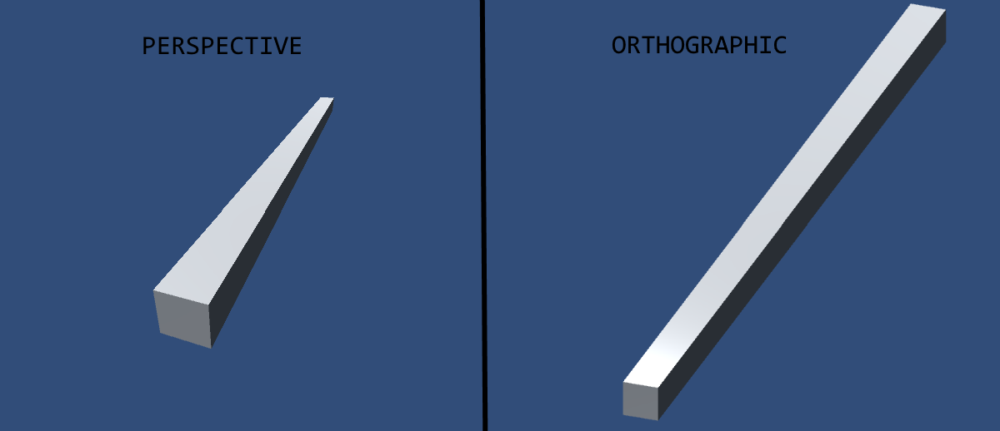

# Unity逆引きリファレンス　カメラ制御

## カメラ制御

### プレイヤーを追従するカメラの基本

以下スクリプトをカメラオブジェクトにアタッチ

```
public Transform player;

void LateUpdate() {
    transform.position = player.position + new Vector3(0, 5, -7);
}
```

- `player`は`public`宣言してインスペクターから指定する。(スクリプトでオブジェクトを取得してもいいのかな)
- `Update()`では各オブジェクトの実行順序が保証されずに、プレイヤー移動→カメラ移動となったり、その逆順序となったりしてカクついて見える。カメラ移動に`LateUpdate()` を使うことでプレイヤーの移動後に実行され、カクつきを防止できる。

### Cinemachineでカメラを追従させる

1. `Window > Package Manager > Cinemachine` をインストール。このパッケージでキャラの追従や特定の範囲内のみを映す、複数のカメラの移動などが可能
2. `Cinemachine > Create 2D Camera` を選択して新しいカメラのオブジェクトをシーンに追加  
3. Virtual Camera の `Follow` に追従させたいオブジェクトをドラッグ  
4. 追加したカメラのインスペクタで`Lens > Orthographic Size` でズーム感調整(ここで設定する値はカメラフレームの縦方向に収まるユニット数の半分)  
5. `Add Extension > Cinemachine Confiner` を追加すればカメラ範囲を制限できる

マップの外側を表示させないようにするには
        
- インスペクタの `Add Extension > CinemachimeConfiner` をクリックして拡張機能を追加する
- Confiner(閉じ込めるの意)に使用する空オブジェクトを新規作成
- Polygon Collider 2Dコンポーネントを追加して、シーン上・インスペクター上でカメラの移動制限範囲を調整
- 該当オブジェクトをConfiner等のレイヤーに設定して他のレイヤーと衝突しないように全てチェック外す
- 先に追加したカメラオブジェクトのCinemachineConfinerのBoundingShape2Dに作成したオブジェクトをアタッチ

追加したカメラは初期設定でOrthographic(並行投影)モードになっている。Perspective(透視投影)との違いは下図


